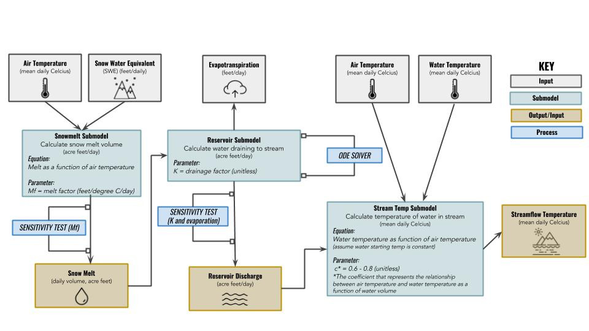

```{r setup, include=FALSE}
knitr::opts_chunk$set(echo = FALSE,
                      message = FALSE,
                      error = FALSE)
```

Requirements:

-Provice some rationale for why this is an important question to answer/management area

- Conceptual model 

- Perform sensitivity analysis for at least two parameters
- At least one sub-model should include a dynmaic ODE model
- Model would involve 3 submodels
-Visualize results in 2 different ways (graphs) 
- Write up results (explain how the model answers your original question/addresses your management area, explain importance of uncertainty in the results and any implications of the results for env. management) 


- SUBMIT! 
- model code (include .Rmd and tack on BRIEF write up at the end)

#####1] Introductory Summary


Some writing here, one sentence. 




**1.** Read in packages. 
```{r}
library(tidyverse)
library(janitor)
library(here)
library(readxl)
library(ggplot2)
library(paletteer)
library(zoo)

#USGS
library(dataRetrieval)

#SNOTEL
library(RNRCS)

#SOBOL
library(sensitivity)

#LHS
library(pse)
```

**2.** Pull in snowpack melt data.
```{r}
#MELT SUBMODEL DATA PULL 
#SWE & AMBIENT AIR: Snotel (843) 
snotel_vallecito_temp_swe <- grabNRCS.data(network = "SNTL", 
                            site_id = 843,
                            timescale = "daily", 
                            DayBgn = "1990-10-01", 
                            DayEnd = "2020-09-30") %>% 
  select(Date, 
         Snow.Water.Equivalent..in..Start.of.Day.Values, 
         Air.Temperature.Average..degF., Air.Temperature.Maximum..degF.) %>% 
  rename(Snow_Water_Equivalent_in = Snow.Water.Equivalent..in..Start.of.Day.Values,
         Daily_Ave_Temp_F = Air.Temperature.Average..degF., 
         Daily_Max_Temp_F = Air.Temperature.Maximum..degF.) %>% 
  mutate(Date = as.Date.character(Date)) %>% 
  mutate(Daily_Ave_Temp_C = (Daily_Ave_Temp_F*0.5556)) %>% 
  mutate(Daily_Max_Temp_C = (Daily_Max_Temp_F*0.5556))


snotel_clean <- snotel_vallecito_temp_swe %>% 
  mutate(year = lubridate::year(Date)) %>% 
  mutate(year = as.numeric(year)) %>% 
  mutate(month = lubridate::month(Date)) %>% 
  mutate(month = as.numeric(month)) %>% 
  mutate(day = lubridate::day(Date)) %>% 
mutate(day = as.numeric(day))


snotel_final_swe <- snotel_clean %>% 
  mutate(swe_ft = (Snow_Water_Equivalent_in/12)) %>% 
  select(Date, year, month, day, temp = Daily_Ave_Temp_C, swe_ft) %>% 
  transform(temp = ave(temp, FUN = na.approx))
```


**3.** Read in snowpack melt model.
```{r}

source("../R/melt_submodel.R") 

```

**4.** Run melt_submodel with SNOTEL data.
```{r}

input_year = 2015

melt_df <- as.data.frame(melt(SWE = snotel_final_swe, input_year = input_year, mf = 0.0131234, flow_only = FALSE))
  

```


**5.** Perform sensitivity analysis on melt factor (mf).
```{r}
# sobol method


# number of parameters
 np = 500

# # distributions for parameters
 sobol_mf = rnorm(mean = 0.0131234, sd = 0.0098425, n = np)

 X1 = cbind.data.frame(sobol_mf)

 sobol_mf = rnorm(mean = 0.0131234, sd = 0.0098425, n = np)

 X2 = cbind.data.frame(sobol_mf)

 sensitivity_mf = sobol2007(model = NULL, X1, X2, nboot = 100)

 mf_sobol_result = mapply(FUN = melt,
                          mf = sensitivity_mf$X$sobol_mf,
                          MoreArgs = list(SWE = snotel_final_swe, input_year = input_year))

sobol_tell = sensitivity::tell(sensitivity_mf, mf_sobol_result)

# something going wrong in the tell step

#sobol_tell$S

#sobol_tell$T

#plot(sobol_tell)

############################ LHS Method

factors = c("sens_mf")

nsets = 100

q = c("qunif")

q.arg = list(min = 0.00328084, max = 0.0229659)

y = LHS(NULL, factors, nsets, q, q.arg)
LHS_pars = get.data(y)

LHS_results = matrix(nrow = nsets, ncol = 1)

LHS_model_results = mapply(FUN = melt,
                           mf = LHS_pars$sens_mf,
                           input_year = input_year,
                           MoreArgs = list(SWE = snotel_final_swe))

LHS_results = matrix(unlist(LHS_model_results), ncol = 1, byrow = TRUE)

colnames(LHS_results) = c("sens_mf")

y = pse::tell(y, t(LHS_results))

# tell step isn't working again...

#pse::plotprcc(y)

#y$prcc

```

**6.** Graph results.
```{r}

melt_plot <- ggplot(data = melt_df) +
  geom_area(aes(x = date, y = tot_SWE/1000, group = 1, color = "tot_SWE"), size = 1, fill = "lightblue") +
  geom_col(aes(x = date, y = flow/1000, color = "flow"), fill = "cornflowerblue") +
  geom_line(aes(x = date, y = temp*10, color = "temp"), fill = "goldenrod") +
  theme_classic() +
  ggtitle("Snopack Melt 2015 - SNOTEL Gauge 843") +
  xlab("Date") +
  theme(plot.title = element_text(size=12))+
  theme(axis.title = element_text(size = 10)) +
  theme(legend.title = element_text(size=10)) +
  theme(plot.title = element_text(hjust = 0.5))+
  theme(legend.position = "bottom") +
  theme(legend.background = element_rect(color = "NA", fill = NA))+  
 scale_color_manual(labels = c("Melt", 
                               "Temp",
                               "Total SWE"), 
                    values = c("cornflowerblue", 
                               "goldenrod", 
                               "lightblue")) +
   scale_y_continuous(expand = c(0,0),
    name = "Daily Total SWE & Melt\n(thousands of acre feet)\n",
    sec.axis = sec_axis( trans=~./10, name="Daily Mean Temperature\n(degrees Celcius)\n")
  ) +
  scale_x_date(expand = c(0,0)) +
  guides(color=guide_legend(override.aes=list(fill=NA)))
  
melt_plot

```


**7.** Read in bathtub/watershed storage model.
```{r}

source("../R/bathtub_submodel.R")


```

**8.** Run bathtub_submodel with results from snowpack melt. ODE (if time allows) 
```{r}

bathtub_df <- as.data.frame(outflow(input_df = melt_df, storage_initial = 70555, k = 0.05, evap = 22.66, outflow_only = FALSE))


```


**9.** Perform sensitivity analysis on K and evaporation.
```{r}

# number of parameters
 np = 500

# distributions for parameters
 sobol_k = runif(max = 0.1, min = 0, n = np)
 sobol_evap = rnorm(mean = 22.6, sd = 0.2, n = np)

 X1 = cbind.data.frame(sobol_k, sobol_evap)

 sobol_k = runif(max = 0.1, min = 0, n = np)
 sobol_evap = rnorm(mean = 22.6, sd = 0.2, n = np)

 X2 = cbind.data.frame(sobol_k, sobol_evap)

 sensitivity_res = sobol2007(model = NULL, X1, X2, nboot = 100)

########

res_sobol_result = mapply(FUN = outflow,
                          k = sensitivity_res$X$sobol_k,
                          evap = sensitivity_res$X$sobol_evap,
                          MoreArgs = list(input_df = melt_df, storage_initial = 70555))

sobol_tell = sensitivity::tell(sensitivity_res, res_sobol_result, sobol_result.names = "mean_outflow")


sobol_tell$S

sobol_tell$T

plot(sobol_tell)

# it runs, but really not sure what is goiign on with these values???

#LHS Method

factors = c("sens_k", "sens_evap")

nsets = 100

q = c("qunif", "qnorm")

sd_evap = abs(22.66 * 0.2)

q.arg = list(list(max = 0.1, min = 0), list(mean = 22.66, sd = sd_evap))

y = LHS(NULL, factors, nsets, q, q.arg)
LHS_pars = get.data(y)

LHS_results = matrix(nrow = nsets, ncol = 2)

LHS_model_results = mapply(FUN = outflow,
                          k = LHS_pars$sens_k,
                          evap = LHS_pars$sens_evap,
                          MoreArgs = list(input_df = melt_df, storage_initial = 70555))

LHS_results = matrix((unlist(LHS_model_results)), ncol = 2, byrow = TRUE)

colnames(LHS_results) = c("sens_k", "sens_evap")

y = pse::tell(y, t(LHS_results))

pse::plotprcc(y)

y$prcc


# now need to add uncertainty bounds on our estimates

LHS_results = as.data.frame(LHS_results)

LHS_results = LHS_results %>% gather(value="mean_value", key="outflow")

ggplot(LHS_results, aes(outflow, mean_value, col=outflow))+geom_boxplot()+labs(y="Mean Outflow", x ="")

# cumulative distribution

ggplot(LHS_results, aes(mean_value)) +
  stat_ecdf(geom = "step") +
  xlab("Mean Outflow") +
  labs(title = "Cumulative Distribution LHS Method") +
  theme_classic()

```

**10.** Graph results.
```{r}

bathtub_plot <- ggplot(data = bathtub_df) +
  geom_area(aes(x = date, 
                y = storage_final, 
                group = 1, 
                color = "storage_final"), 
            size = 1, 
            fill = "lightgrey", 
            alpha = 0.5) +
  geom_area(aes(x = date, 
                y = flow_in, 
                group = 1, 
                color = "flow_in"), 
                size = 0, 
                fill = "cornflowerblue", 
                alpha = 0.5) +
  geom_line(aes(x = date, 
                y = flow_out_final, 
                group = 1, 
                color = "flow_out_final"), 
            size = 0.5) +
  theme_classic() +
  ggtitle("Resevoir Storage, Inflow and Outlfow in 2015") +
  xlab("Date") +
  ylab("Water (acre feet)\n") +
  theme(plot.title = element_text(size=12))+
  theme(axis.title = element_text(size = 10)) +
  theme(legend.title = element_text(size=10)) +
  theme(plot.title = element_text(hjust = 0.5))+
  theme(legend.position = "bottom") +
  theme(legend.background = element_rect(color = NA, 
                                         fill = NA))+ 
  theme(legend.key = element_rect(color = "white",  
                                  fill = "white"))+
  guides(color=guide_legend("Resevoir Data")) +
 scale_color_manual(labels = c("Flow In", 
                               "Flow Out", 
                               "Storage"
                               ), 
                    values = c("cornflowerblue", 
                               "coral", 
                               "lightgrey"
                               )) +
  scale_y_continuous(expand = c(0,0), limits = c(0, 150000)) +
  scale_x_date(expand = c(0,0)) +
  geom_hline(aes(yintercept = 129700),
             color = "black",
             linetype = "dashed",
             size = 0.5) +
   guides(color=guide_legend(override.aes=list(fill=NA)))
  
bathtub_plot
  
```

**11.** Read in temperature data.
```{r}
ambient <- read_csv(here::here("Data", "ambient_air_tempmodel.csv")) %>% 
  mutate(daily_max_temp_c = as.numeric(daily_max_temp_c)) %>% 
  transform(daily_max_temp_c = ave(daily_max_temp_c, FUN = na.approx))
  

water <- read_csv(here::here("Data", "water_temp_tempmodel.csv")) %>% 
  mutate(mean_water_temp_c = replace_na(mean_water_temp_c,0))


water_2015 <- water %>% 
  filter(year == 2015)

```

**12.** Read in temperature model.
```{r}
source("../R/temperature_submodel.R") 

```

**13.** Run temperature model with temperature data.
```{r}

water_temp <- as.data.frame(water_temp(ambient = ambient, water = water, bathtub_df = bathtub_df, input_year = input_year)) %>% 
  mutate(temp_w_change = temp_calc - temp_w)

```

**14.** Graph results.
```{r}

# water_temp_graph <- water_temp %>% 
#   group_by(week = paste(week(date))) %>% 
#   group_by(week) %>% 
#   mutate(week_temp_a = mean(temp_a)) %>% 
#   mutate(week_temp_w_change = mean(temp_w_change))
  


temp_plot <- ggplot(data = water_temp) +
  geom_line(aes(x = date, 
                y = temp_a, 
                group = 1, 
                color = "temp_a")) +
    geom_line(aes(x = date, 
                y = temp_w_change, 
                group = 1, 
                color = "temp_w_change")
             ) +
  geom_col(aes(x = date, 
                y = flow/10000, 
                group = 1, 
                color = "flow"), 
            fill = "lightblue",
           alpha = 0.5,
            size = 0.5) +
  theme_classic() +
  ggtitle("Resevoir Storage, Inflow and Outlfow in 2015") +
  xlab("Date") +
  ylab("Water (acre feet)\n") +
  theme(plot.title = element_text(size=12))+
  theme(axis.title = element_text(size = 10)) +
  theme(legend.title = element_text(size=10)) +
  theme(plot.title = element_text(hjust = 0.5))+
  theme(legend.position = "bottom") +
  theme(legend.background = element_rect(color = NA, 
                                         fill = NA))+ 
  theme(legend.key = element_rect(color = "white",  
                                  fill = "white"))+
  guides(color=guide_legend("")) +
 scale_color_manual(labels = c("Daily Flow", 
                               "Ambiant Temperature",
                               "Water Temperature"), 
                    values = c("lightblue", 
                               "goldenrod", 
                               "khaki3")) +
   scale_y_continuous(expand = c(0,0),
                      
    name = "Water & Ambiant Temperature\n(degrees Celcius)\n",
    
    sec.axis = sec_axis( trans=~.*10, name="Daily Flow\n(thousands of acre feet/day)\n")
    
  ) +
  scale_x_date(expand = c(0,0))+
  guides(color=guide_legend(override.aes=list(fill=NA)))
  
temp_plot


temp_plot_2 <- ggplot(data = water_temp) +
  geom_line(aes(x = date, 
                y = temp_a, 
                group = 1, 
                color = "temp_a")) +
    geom_line(aes(x = date, 
                y = temp_w_change, 
                group = 1, 
                color = "temp_w_change")
             ) +
  geom_col(aes(x = date, 
                y = flow/10000, 
                group = 1, 
                color = "flow"),
           fill = "lightblue",
           alpha = 0.5,
            size = 0.5) +
  theme_classic() +
  ggtitle("Resevoir Storage, Inflow and Outlfow\nMarch - June 2015") +
  xlab("Date") +
  ylab("Water (acre feet)\n") +
  theme(plot.title = element_text(size=12))+
  theme(axis.title = element_text(size = 10)) +
  theme(legend.title = element_text(size=10)) +
  theme(plot.title = element_text(hjust = 0.5))+
  theme(legend.position = "bottom") +
  theme(legend.background = element_rect(color = NA, 
                                         fill = NA))+ 
  theme(legend.key = element_rect(color = "white",  
                                  fill = "white"))+
  guides(color=guide_legend("")) +
 scale_color_manual(labels = c("Daily Flow", 
                               "Ambiant Temperature",
                               "Water Temperature"), 
                    values = c("lightblue", 
                               "goldenrod", 
                               "khaki3")) +
   scale_y_continuous(expand = c(0,0),
                      
    name = "Water & Ambiant Temperature\n(degrees Celcius)\n",
    
    sec.axis = sec_axis( trans=~.*10, name="Daily Flow\n(thousands of acre feet/day)\n")
    
  ) +
  scale_x_date(expand = c(0,0),
               limits = as.Date(c("2015-03-01","2015-06-30")))+
  guides(color=guide_legend(override.aes=list(fill=NA)))
  
temp_plot_2

# maybe would be nice to calculate some sort of running average to visualize overall trends?
```